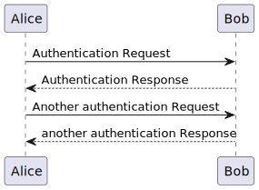

To draw diagram by code, we have 2 powerful tools: Mermaid and PlantUML. Currently (20/12/2022), Mermaid is supported by both Gitlab and Github, but PlantUML is supported by Gitlab only.

Personally I often use PlantUML because it is very flexible in drawing any diagram.

So, here is how I made trick to display PlantUML on Github.

### Step 1: Create seperate .puml file to write PlantUML code

i.e.
file: `test_diagram.puml`
```
@startuml
Alice -> Bob: Authentication Request
Bob --> Alice: Authentication Response

Alice -> Bob: Another authentication Request
Alice <-- Bob: another authentication Response
@enduml
```

### Step 2: Convert file .puml to .svg file

This step we can use multiple tools.
* Solution 1: Go to site https://www.plantuml.com/plantuml/uml/SyfFKj2rKt3CoKnELR1Io4ZDoSa70000, pass the PlantUML code in file `test_diagram.puml` to editor, and download svg file to your local, i.e. file `test_diagram.svg`
* Solution 2: Install extention PlantUML (by jebbs) on VS Code. Right click in the puml file, choose `Export Current Diagram`, and choose `svg`, then the extension will export svg to output folder (default folder is `out` in your root workspace folder). Copy that svg file to your target folder

### Step 3: Display .svg file in markdown file

```

```
and it will show like this:
